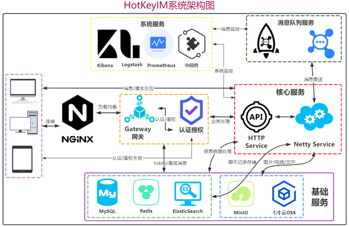
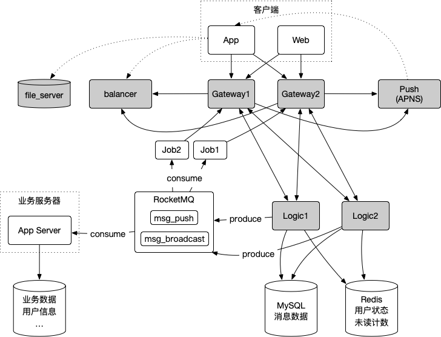

# 🍬Hot Key IM 
## 👨‍💻简介
HotKeyIM 是一个使用Web技术实现的实时在线即时通讯，聊天的Web应用，能够支持简单的好友私聊，群聊，用户发现，能够支持您发送各种各样的消息，
例如：文本，表情，图片，文件，链接，语言，投票，代码，红包，地理位置等，并且可以进行语音，视频通话，进行群聊的白板演示，屏幕控制等功能，
本应用目前还是一个单体架构的应用，采用Spring Boot, Netty, Vue, WebRTC, RocketMQ, MinIO, Redis, ES, Neo4j等主流技术

## 🔧系统设计

本应用基于Web的即时通讯平台系将采用前后端分离的开发模式，客户端采用Vue.js框架进行开发，实现跨平台与响应式的客户端展示界面；
在实现即时通讯上使用Netty网络编程框架作为即时通讯服务器，使用Spring Boot实现其余REST风格的功能，
并且将Netty 交付给Spring进行统一管理；在Chat Server和Push Server中引入RocketMQ作为消息分发服务；
应用的数据支持采用MySQL关系型数据库进行结构化数据存储，使用Redis对用户信息，会话等数据进行缓存。
采用Neo4j图数据库实现好友社交网络图谱的构建，并且以此提供推荐服务，搜索模块功能使用Elastic Search进行好友，聊天记录的搜索。

## 📃功能说明
### 聊天功能
目前已经支持了文本消息，表情消息，图片消息, 文件消息，文件消息下载，在线预览

## 设计实现中
成功实现语音消息

成功实现代码消息功能

## 🍰新的功能
后续会依次实现一下功能：
- [X] 普通文本消息
- [X] 表情消息
- [X] 图片消息
- [X] 文件消息
- [X] 语音消息
- [ ] 音视频通话
- [X] 代码消息
- [ ] 红包消息
- [ ] 白板演示
- [ ] 群直播

## 📰参考文献
1. [如何设计一个亿级消息量的 IM 系统](https://xie.infoq.cn/article/19e95a78e2f5389588debfb1c)
2. [即时通讯网-IM开发者社区](http://www.52im.net/)
3. [IM通讯协议专题学习(一)：Protobuf从入门到精通，一篇就够！](https://cloud.tencent.com/developer/article/2157831)
4. [微服务环境下如何做到一个职责分离的IM服务](https://www.cnblogs.com/theseventhson/p/16625031.html)
5. [设计聊天系统概论](https://www.midlane.top/wiki/pages/viewpage.action?pageId=21659855)
6. [IM系统海量消息数据是怎么存储的](http://blog.itpub.net/31556438/viewspace-2639412/)
7. [聊天应用的架构，协议，数据存储的设计](https://github.com/xmcy0011/CoffeeChat/blob/master/docs/02-%E6%9E%B6%E6%9E%84%E5%92%8C%E5%8D%8F%E8%AE%AE%E8%AE%BE%E8%AE%A1.md)
8. [IM API接口实现参考](https://doc.rentsoft.cn:8000/swagger/index.html#/%E7%94%A8%E6%88%B7%E7%9B%B8%E5%85%B3)
9. [IM API接口设计参考](https://doc.rentsoft.cn/#/uniapp_v2/sdk_integrate/group)
10. [群聊系统的架构设计](https://donggeitnote.com/2022/01/08/im-architecture/)