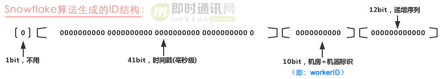
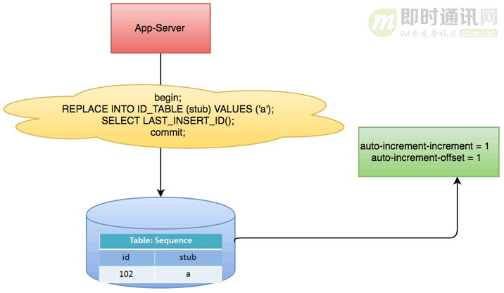
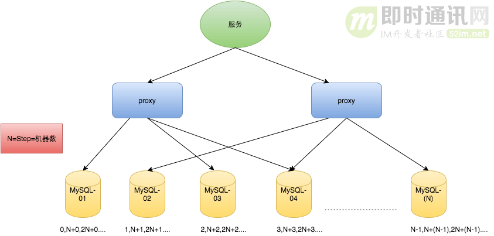
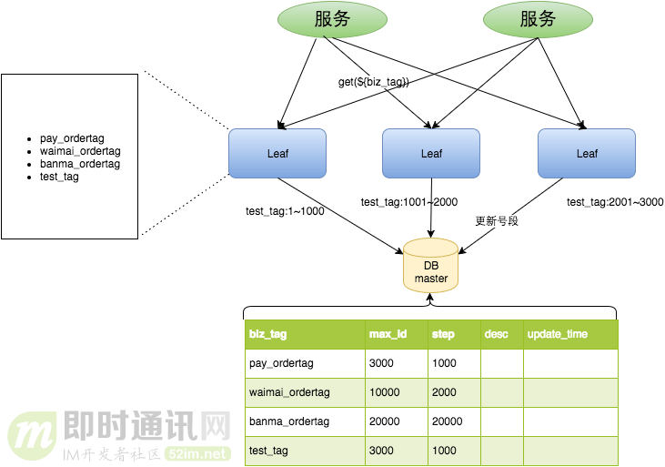
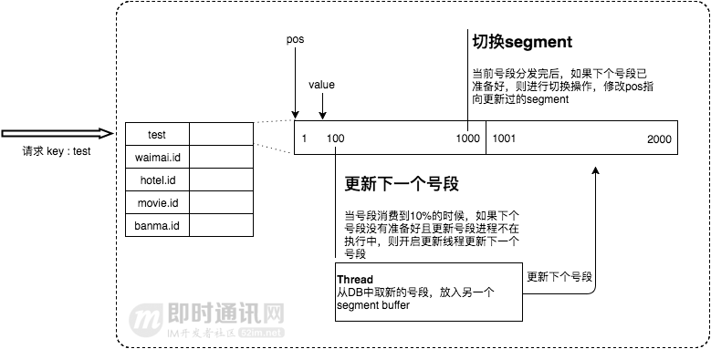

# 一个较为完善的IM及时通讯应用的消息设计


在综合考虑对比了`轮询`，`长轮询`，`SSE+UDP/QUIC`，`WebSocket` 等一系列的用于维持聊天应用通信的方案后，最终选择了基于 `WebSocket` 的通信方式来作为我的IM应用的聊天传输协议

相对与其他而言，它具有一下比较明显的优势：
1. 全双工
2. 使用较为简单，实现复杂度低
3. 在大量连接下，性能效率更好
4. 技术支持较为完善，相关资料丰富


## 消息
## 聊天消息
用于传输，聊天中产生的各种超媒体消息数据：


| 名称        | 类名                       | 传输协议      |
|-----------|--------------------------|-----------|
| 连接初始化消息   | ConnectMessage           | WebSocket |
| 普通聊天消息    | SimpleChatMessage        | WebSocket |
| 图片聊天消息    | PictureChatMessage       | HTTP      |
| 文件/视频聊天消息 | MultipartFileChatMessage | HTTP      |
| 消息签收消息    | MessageSignedMessage     | WebSocket |
| 好友拉取消息    | FriendPullMessage        | WebSocket |
| 好友拉取消息    | FriendPullMessage        | WebSocket |


## 控制消息
## 系统消息

## text文本类型消息


## 自定义协议/二进制数据消息

## 消息ID的设计与思考
很显而易见的是我们的IM应用程序中出现最多的数据肯定是消息，无论是私聊消息，群聊消息，控制消息，系统消息，多媒体消息等，这对于我们数据库而言意味着大量的数据记录，而且会相应的出现大量的查询亲求，
这就需要我们的消息table 的主键是要符合一个高效的主键策略的，这样有助于我们InnoDB 的索引的创建，维护，以及后续查询等操作的保证。
一般意义上分布式ID的生成算法可能有：UUID策略，数据库自增，TDDL-Sequence，Leaf-Segment，雪花算法等，以及各大公司自研，修改，改进的各种算法。
但是我们的IM消息需要高效，有序存储，高效查询，这样的主键一般而言我们有一下几点很容易想到的：
1. 主键应该是数值类型
2. 主键的生成因该是分布式，全局唯一的
3. 主键应该要满足递增的特性

因为在整个IM应用中需要涉及到关于消息的发送，撤回，阅读，未读以及对于聊天记录的查看导出，会话列表的聊天内容的渲染等功能，所以在一定程度上需要我们保证消息之间的顺序问题。
这里就有很多可以参考的思路，因为我们的消息ID需要递增，分布式，全局唯一，并且根据业务需求而言，其实不仅仅是消息ID的全局唯一，其实还需要保证每个会话的消息ID是递增的，
很显然，满足这些条件的ID策略还是很多的：著名的雪花算法，以及各大公司改进的雪花算法(百度，美团)，TDDL-Sequence, 发号器算法又称为号段算法(比较有代表性的就是美团Leaf-Segment算法)。


尽管有了大致可以选择的消息ID生成算法，但是这里还需要我们进行一定的思考和修改。通常而言，对于聊天消息，消息ID可以只是简单的全局递增就好了，这样所有的会话产生的消息需要进行ID分配的时候就直接采用雪花算法及其改进算法进行分配
，但是这样存在的一个现象就是你会发现即便不是同一会话中的消息，他们的消息ID也是全局有序的，这样如果在一个IM应用中就可能存在QPS的瓶颈问题，而且对于我们IM业务中的
消息发送，接收，读取，未读，撤回等业务场景不是十分友好。

所以，为了后续未来的发展以及业务功能的拓展，往往采用在局部会话下的消息有序是较为合理的方案，换句话而言，我们只需要保证会话级别的消息有序，消息ID递增就可以解决这个聊天业务中的一个难题
。由此我们不妨就选择发号器算法(号段算法)来作为我们的消息ID生成算法。至于原因，可能有如下几点：
1. 发号器算法可以按照业务，分类等进行不同的ID生成。天然的符合我们的会话级别的ID生成，因为我们可以将每个会话都作为以一种概念上的业务。
2. 发号器算法可以保证消息ID的递增，并且是可以控制的增加，而且不存在始终回拨问题(尽管这个问题在雪花算法中以及得到了解决：具体可以参考Seta-Snowflakes)
3. 发号器算法虽然基于数据库，但是可以通过双Buffer 机制实现内存级别的分配，效率并不输雪花算法，UUID等
4. 发号器算法自己曾经实现过(可以查看我的开源项目：[ShotUrl生产器](https://github.com/HK-hub/Short-URL))
5. 市面上成熟的方案：美团Leaf-Segment 是经过检验的

当然上面只是自己的一些看法，肯定是存在比我这种粗暴的想法更加强大，完善的IM消息ID机制存在的，也欢迎各位大牛多多指点。
虽然使用了发号器算法，就能完全实现我们的IM消息ID的需求嘛？ 非常遗憾，还需要经过一系列的思考：
1. 号段起始应该设置为多少？
2. 号段步长应该多少？
3. 号段Buffer更新时机如何？
4. 更新号段，Buffer 的方式？ Version 乐观锁机制？
5. 以及有没有更加安全的方式：如果简单的通过递增，很容易暴露数据信息。能否在这短短的消息ID内加入一些有用的信息：
   1. 比如ID具备会话双方的某些信息：比如ID，账号


既然以及看过了关于消息ID的生成策略思考，那么接下来看看如何才能较为满意的实现把：

首先我们需要数据库的支持，Leaf 算法是基于数据库的：
```sql
# 会话消息ID生产器
CREATE TABLE `tb_sequence` (
   `id` BIGINT NOT NULL primary key AUTO_INCREMENT,
   `name` VARCHAR(64) NOT NULL comment '标识业务类型',
   participant_id bigint not null comment '会话参与者',
   communication_id bigint not null comment '会话发起者',
   max bigint unsigned comment '下一次将要申请的号段起始位置',
   step int default 1 comment '递增步长',
   segment int default 1000 comment '号段大小'

) ENGINE=InnoDB DEFAULT CHARSET=utf8;
create index idx_p_c on tb_sequence(participant_id, communication_id);
```

执行以上SQL 并且编写对应的实体，Mapper，Service 就可以进行操控了，但是我们想要使用该发号器还需要我们设计一些东西：
1. 提供获取id 的接口
2. 维护会话的发号器: 考虑如何存储每个会话的发号器，


## 融云IM消息ID技术
**本文要分享的是融云即时通讯云产品中的聊天消息ID生成算法和策略，
一个19字节的ID就能包含：时间戳、消息类型、会话ID、序列号，小ID、大用途，值得借鉴！**

### 技术背景
对于一套分布式部署的 IM 系统，要求每条消息的 ID 要保证在集群中全局唯一且按生成时间有序排列。如何快速高效的生成消息数据的唯一 ID ，是影响系统吞吐量的关键因素。

那么，融云是如何做到生成全局唯一消息 ID 的呢？

首先需要明确下 ID 生成的核心需求：

- 1）全局唯一；
- 2）有序。

### 设计思路
融云消息数据的唯一 ID 长度采用 80 Bit。

每 5 个 Bit ，进行一次 32 进制编码，转换为一个字符，字符取值范围是：数字 “2 ~ 9 ”和字母“A ~ B”。其中，已经去掉容易造成肉眼混淆的数字 0 和 1 （余下可用的数字就是8个了），及字母 O 和 I（余下可用的字母就是24个了），那么总可用字符就是32个（刚好可按32进制进行编码）。

这样，80 Bit 可以转换为 16 个字符，再加上 3 个分隔符（ - ），将 16 个字符分为 4 组，最终得到一个 19 字符的唯一 ID ，形如：“ BD8U-FCOJ-LDC5-L789 ”。 这样设计，即可以保证生成的 ID 是有序的，也能方便阅读。


如上图所示，80 Bit 被分为 4 段。

- 1）第一段 42 Bit：用于存放时间戳，最长可表示到 2109 年，足够开发者当前使用了。时间戳数据放在高位，可以保证生成的唯一 ID 是按时间有序的，这个是消息 ID 必须要满足的条件。
- 2）第二段 12 Bit：用于存放自旋转 ID 。我们知道，时间戳的精度是到毫秒的，对于一套亿级 IM 系统来说，同一毫秒内产生多条消息太正常不过了，这个自旋 ID 就是在给落到同一毫秒内的消息进行自增编号。12 Bit 则意味着，同一毫秒内，单台主机中最多可以标识 4096（ 2 的 12 次方）条消息。
- 3）第三段 4 Bit：用于标识会话类型。4 Bit ，最多可以标识 16 中会话，足够涵盖单聊、群聊、系统消息、聊天室、客服及公众号等常用会话类型。
- 4）第四段 22 Bit：会话 ID 。如群聊中的群 ID ，聊天室中的聊天室 ID 等。与第三段会话类型组合在一起，可以唯一标识一个会话。其他的一些 ID 生成算法，会预留两段，分别用来标识数据中心编号和主机编号（如 SnowFlake 算法），我们并没有这样做，而是将这两段用来标识会话。这样，ID 生成可以直接融入到业务服务中，且不必关心服务所在的主机，做到无状态扩缩容。


## 美团IM消息ID技术
对于美团的Leaf-segment这个ID生成方案，因为生成的ID全局唯一、全局有序，所以非常适合IM这种应用场景，这也是即时通讯网整理并分享给社区的原因。

友情提示：IM系统中的消息ID不同于电商等传统信息系统，IM中的消息ID通常较少用于服务端架构中的检索目的（例外是：消息撤回等使用频率较低的功能中会用到），
所以服务端架构中的ID查询性能上可以不必追求极致（必竟IM消息对应于人的自然沟通，通常都是以时间为检索条件，比如离线消息拉取、群消息拉取、漫游消息拉取等），
所以在学习诸如美团的ID生成算法时，没有必要生搬硬套，适度借鉴，按照IM系统的特性进行融会贯通地设计才是最佳实践。

### 正文概述
在复杂分布式系统中，往往需要对大量的数据和消息进行唯一标识。如在美团点评的金融、支付、餐饮、酒店、猫眼电影等产品的系统中，
数据日渐增长，对数据分库分表后需要有一个唯一ID来标识一条数据或消息，数据库的自增ID显然不能满足需求；特别一点的如订单、骑手、优惠券也都需要有唯一ID做标识。
此时一个能够生成全局唯一ID的系统是非常必要的。


概括下来，那业务系统对ID号的要求有哪些呢？

- 1）全局唯一性：不能出现重复的ID号，既然是唯一标识，这是最基本的要求；
- 2）趋势递增：在MySQL InnoDB引擎中使用的是聚集索引，由于多数RDBMS使用B-tree的数据结构来存储索引数据，在主键的选择上面我们应该尽量使用有序的主键保证写入性能；
- 3）单调递增：保证下一个ID一定大于上一个ID，例如事务版本号、IM聊天中的增量消息、排序等特殊需求；
- 4）信息安全：如果ID是连续的，恶意用户的扒取工作就非常容易做了，直接按照顺序下载指定URL即可；如果是订单号就更危险了，竞对可以直接知道我们一天的单量。所以在一些应用场景下，会需要ID无规则、不规则。

上述123对应三类不同的场景，3和4需求还是互斥的，无法使用同一个方案满足。
由此总结下一个分布式ID生成系统应做到如下几点：

- 1）平均延迟和TP999延迟都要尽可能低；
- 2）可用性5个9；
- 3）高QPS。


### 为什么不用UUID
UUID（Universally Unique Identifier）的标准型式包含32个16进制数字，以连字号分为五段，形式为8-4-4-4-12的36个字符，示例：550e8400-e29b-41d4-a716-446655440000，到目前为止业界一共有5种方式生成UUID，详情见IETF发布的UUID规范：《A Universally Unique IDentifier (UUID) URN Namespace》。

对于美团点评这些具体的业务系统来说，UUID有以下优点和缺点。

优点：
性能非常高：本地生成，没有网络消耗。

缺点：
1）不易于存储：UUID太长，16字节128位，通常以36长度的字符串表示，很多场景不适用；
2）信息不安全：基于MAC地址生成UUID的算法可能会造成MAC地址泄露，这个漏洞曾被用于寻找梅丽莎病毒的制作者位置。

ID作为主键时在特定的环境会存在一些问题，比如做DB主键的场景下，UUID就非常不适用：

- ① MySQL官方有明确的建议主键要尽量越短越好[4]，36个字符长度的UUID不符合要求：
> All indexes other than the clustered index are known as secondary indexes. 
> In InnoDB, each record in a secondary index contains the primary key columns for the row, as well as the columns specified for the secondary index. 
> InnoDB uses this primary key value to search for the row in the clustered index.*** 
> If the primary key is long, the secondary indexes use more space, so it is advantageous to have a short primary key***.

- ② 对MySQL索引不利：如果作为数据库主键，在InnoDB引擎下，UUID的无序性可能会引起数据位置频繁变动，严重影响性能。

总之，UUID有很多合适的应用场景，但对于美团点评相关的业务系统来说，UUID显然不是最佳选择。


### 为什么不用Snowflake算法
**SnowFlake算法原理**
SnowFlake 算法，是 Twitter 开源的分布式 ID 生成算法。其核心思想就是：使用一个 64 bit 的 long 型的数字作为全局唯一 ID。

这 64 个 bit 中，其中 1 个 bit 是不用的，然后用其中的 41 bit 作为毫秒数，用 10 bit 作为工作机器 ID，12 bit 作为序列号。

**SnowFlake的ID构成：**

**SnowFlake的ID样本：**

给大家举个例子吧，如上图所示，比如下面那个 64 bit 的 long 型数字：

- 1）第一个部分，是 1 个 bit：0，这个是无意义的；
- 2）第二个部分，是 41 个 bit：表示的是时间戳；
- 3）第三个部分，是 5 个 bit：表示的是机房 ID，10001；
- 4）第四个部分，是 5 个 bit：表示的是机器 ID，1 1001；
- 5）第五个部分，是 12 个 bit：表示的序号，就是某个机房某台机器上这一毫秒内同时生成的 ID 的序号，0000 00000000。

① 1 bit：是不用的，为啥呢？

因为二进制里第一个 bit 为如果是 1，那么都是负数，但是我们生成的 ID 都是正数，所以第一个 bit 统一都是 0。

② 41 bit：表示的是时间戳，单位是毫秒。

41 bit 可以表示的数字多达 2^41 - 1，也就是可以标识 2 ^ 41 - 1 个毫秒值，换算成年就是表示 69 年的时间。

③ 10 bit：记录工作机器 ID，代表的是这个服务最多可以部署在 2^10 台机器上，也就是 1024 台机器。

但是 10 bit 里 5 个 bit 代表机房 id，5 个 bit 代表机器 ID。意思就是最多代表 2 ^ 5 个机房（32 个机房），每个机房里可以代表 2 ^ 5 个机器（32 台机器）。

④12 bit：这个是用来记录同一个毫秒内产生的不同 ID。

12 bit 可以代表的最大正整数是 2 ^ 12 - 1 = 4096，也就是说可以用这个 12 bit 代表的数字来区分同一个毫秒内的 4096 个不同的 ID。理论上snowflake方案的QPS约为409.6w/s，这种分配方式可以保证在任何一个IDC的任何一台机器在任意毫秒内生成的ID都是不同的。

简单来说，你的某个服务假设要生成一个全局唯一 ID，那么就可以发送一个请求给部署了 SnowFlake 算法的系统，由这个 SnowFlake 算法系统来生成唯一 ID。
- 1）这个 SnowFlake 算法系统首先肯定是知道自己所在的机房和机器的，比如机房 ID = 17，机器 ID = 12；
- 2）接着 SnowFlake 算法系统接收到这个请求之后，首先就会用二进制位运算的方式生成一个 64 bit 的 long 型 ID，64 个 bit 中的第一个 bit 是无意义的；
- 3）接着 41 个 bit，就可以用当前时间戳（单位到毫秒），然后接着 5 个 bit 设置上这个机房 id，还有 5 个 bit 设置上机器 ID；
- 4）最后再判断一下，当前这台机房的这台机器上这一毫秒内，这是第几个请求，给这次生成 ID 的请求累加一个序号，作为最后的 12 个 bit。

**最终一个 64 个 bit 的 ID 就出来了，类似于：**

这个算法可以保证说，一个机房的一台机器上，在同一毫秒内，生成了一个唯一的 ID。可能一个毫秒内会生成多个 ID，但是有最后 12 个 bit 的序号来区分开来。

下面我们简单看看这个 SnowFlake 算法的一个代码实现，这就是个示例，大家如果理解了这个意思之后，以后可以自己尝试改造这个算法。

总之就是用一个 64 bit 的数字中各个 bit 位来设置不同的标志位，区分每一个 ID。

**SnowFlake算法的代码实现：**
SnowFlake 算法的一个典型Java实现代码，可以参见文章中的第“6.5 方案四：SnowFlake 算法的思想分析”节：《通俗易懂：如何设计能支撑百万并发的数据库架构？》，是Jack Jiang曾在某项目中实际使用过的代码。

**对于美团来说，SnowFlake算法的优缺点**
对于美团的业务系统来说，这种方式的优缺点如下。

► 优点：
1）毫秒数在高位，自增序列在低位，整个ID都是趋势递增的；
2）不依赖数据库等第三方系统，以服务的方式部署，稳定性更高，生成ID的性能也是非常高的；
3）可以根据自身业务特性分配bit位，非常灵活。

► 缺点：
强依赖机器时钟，如果机器上时钟回拨，会导致发号重复或者服务会处于不可用状态。

► 应用举例——Mongdb的objectID：
MongoDB官方文档 ObjectID 可以算作是和snowflake类似方法，通过“时间+机器码+pid+inc”共12个字节，通过4+3+2+3的方式最终标识成一个24长度的十六进制字符。


### 为什么不用数据库自增
以MySQL举例，利用给字段设置auto_increment_increment和auto_increment_offset来保证ID自增，每次业务使用下列SQL读写MySQL得到ID号。
```sql
begin;
REPLACE INTO Tickets64 (stub) VALUES ('a');
SELECT LAST_INSERT_ID();
commit;
```


这种方案的优缺点如下。

优点：

- 1）非常简单，利用现有数据库系统的功能实现，成本小，有DBA专业维护；
- 2）ID号单调自增，可以实现一些对ID有特殊要求的业务。

缺点：

- 1）强依赖DB，当DB异常时整个系统不可用，属于致命问题。配置主从复制可以尽可能的增加可用性，但是数据一致性在特殊情况下难以保证。主从切换时的不一致可能会导致重复发号；
- 2）ID发号性能瓶颈限制在单台MySQL的读写性能。

对于MySQL性能问题，可用如下方案解决：在分布式系统中可以多部署几台机器，每台机器设置不同的初始值，且步长和机器数相等。比如有两台机器。
设置步长step为2，TicketServer1的初始值为1（1，3，5，7，9，11…）、TicketServer2的初始值为2（2，4，6，8，10…）。
这是Flickr团队在2010年撰文介绍的一种主键生成策略（详见：《Ticket Servers: Distributed Unique Primary Keys on the Cheap》）。
如下所示，为了实现上述方案分别设置两台机器对应的参数，TicketServer1从1开始发号，TicketServer2从2开始发号，两台机器每次发号之后都递增2。

```sql
TicketServer1:
auto-increment-increment = 2
auto-increment-offset = 1
 
TicketServer2:
auto-increment-increment = 2
auto-increment-offset = 2
```

**假设我们要部署N台机器，步长需设置为N，每台的初始值依次为0,1,2…N-1那么整个架构就变成了如下图所示：**


这种必读是后的架构貌似能够满足性能的需求，但有以下几个缺点：

1）系统水平扩展比较困难：比如定义好了步长和机器台数之后，如果要添加机器该怎么做？假设现在只有一台机器发号是1,2,3,4,5（步长是1），这个时候需要扩容机器一台。可以这样做：把第二台机器的初始值设置得比第一台超过很多，比如14（假设在扩容时间之内第一台不可能发到14），同时设置步长为2，那么这台机器下发的号码都是14以后的偶数。然后摘掉第一台，把ID值保留为奇数，比如7，然后修改第一台的步长为2。让它符合我们定义的号段标准，对于这个例子来说就是让第一台以后只能产生奇数。扩容方案看起来复杂吗？貌似还好，现在想象一下如果我们线上有100台机器，这个时候要扩容该怎么做？简直是噩梦。所以系统水平扩展方案复杂难以实现；
2）ID没有了单调递增的特性：只能趋势递增，这个缺点对于一般业务需求不是很重要，可以容忍；
3）数据库压力还是很大：每次获取ID都得读写一次数据库，只能靠堆机器来提高性能。

综合对比上述几种方案，每种方案都不完全符合我们的要求。所以美团建立了Leaf工程（Leaf这个名字是来自德国哲学家、数学家莱布尼茨的一句话： >There are no two identical leaves in the world > “世界上没有两片相同的树叶”），分别在上述第二种（Snowflake）和第三种（数据库自增ID）方案上做了相应的优化，实现了Leaf-snowflake和Leaf-segment方案。接下来，我们详细介绍这两种方案的实现思路。


### Leaf-segment方案：可生成全局唯一、全局有序的ID
#### 基本原理
美团的Leaf-segment方案，实际上是在上面介绍的数据库自增ID方案上的一种改进方案，它可生成全局唯一、全局有序的ID，可以用于：事务版本号、IM聊天中的增量消息、全局排序等业务中。

美团的Leaf-segment对数据库自增ID方案做了如下改变：

- 1）原方案每次获取ID都得读写一次数据库，造成数据库压力大。改为利用proxy server批量获取，每次获取一个segment(step决定大小)号段的值。用完之后再去数据库获取新的号段，可以大大的减轻数据库的压力；
- 2）各个业务不同的发号需求用biz_tag字段来区分，每个biz-tag的ID获取相互隔离，互不影响。如果以后有性能需求需要对数据库扩容，不需要上述描述的复杂的扩容操作，只需要对biz_tag分库分表就行。

**数据库表设计如下：**
```sql
+-------------+--------------+------+-----+-------------------+-----------------------------+
| Field       | Type         | Null | Key | Default           | Extra                       |
+-------------+--------------+------+-----+-------------------+-----------------------------+
| biz_tag     | varchar(128) | NO   | PRI |                   |                             |
| max_id      | bigint(20)   | NO   |     | 1                 |                             |
| step        | int(11)      | NO   |     | NULL              |                             |
| desc        | varchar(256) | YES  |     | NULL              |                             |
| update_time | timestamp    | NO   |     | CURRENT_TIMESTAMP | on update CURRENT_TIMESTAMP |
+-------------+--------------+------+-----+-------------------+-----------------------------+
```

**重要字段说明**：
> biz_tag：用来区分业务；
> max_id：表示该biz_tag目前所被分配的ID号段的最大值；
> step：表示每次分配的号段长度。

原来获取ID每次都需要写数据库，现在只需要把step设置得足够大，比如1000。那么只有当1000个号被消耗完了之后才会去重新读写一次数据库。

**读写数据库的频率从1减小到了1/step，大致架构如下图所示：**


test_tag在第一台Leaf机器上是1~1000的号段，当这个号段用完时，会去加载另一个长度为step=1000的号段，假设另外两台号段都没有更新，这个时候第一台机器新加载的号段就应该是3001~4000。

同时数据库对应的biz_tag这条数据的max_id会从3000被更新成4000，更新号段的SQL语句如下：
```sql
Begin
UPDATE table SET max_id=max_id+step WHERE biz_tag=xxx
SELECT tag, max_id, step FROM table WHERE biz_tag=xxx
Commit
```

微信扫一扫关注！
本文来自美团技术团队“照东”的分享，原题《Leaf——美团点评分布式ID生成系统》，即时通讯网收录时有勘误、修订并重新排版，感谢原作者的分享。


1、引言

鉴于IM系统中聊天消息ID生成算法和生成策略的重要性（因为某种意义上来说：聊天消息ID的优劣决定了IM应用层某些功能实现的难易度），所以即时通讯网近期正在着重整理有关IM中的聊天消息ID算法方面的文章，包括微信团队的这篇《微信技术分享：微信的海量IM聊天消息序列号生成实践（算法原理篇）》，以及融云分享的《融云技术分享：解密融云IM产品的聊天消息ID生成策略》一文。

本文分享了美团系统中正在使用的两种ID生成算法：

1）Leaf-segment方案：可生成全局唯一、全局有序的ID；
2）Leaf-snowflake方案：可生成全局唯一、局部有序的ID。

对于美团的Leaf-segment这个ID生成方案，因为生成的ID全局唯一、全局有序，所以非常适合IM这种应用场景，这也是即时通讯网整理并分享给社区的原因。

友情提示：IM系统中的消息ID不同于电商等传统信息系统，IM中的消息ID通常较少用于服务端架构中的检索目的（例外是：消息撤回等使用频率较低的功能中会用到），所以服务端架构中的ID查询性能上可以不必追求极致（必竟IM消息对应于人的自然沟通，通常都是以时间为检索条件，比如离线消息拉取、群消息拉取、漫游消息拉取等），所以在学习诸如美团的ID生成算法时，没有必要生搬硬套，适度借鉴，按照IM系统的特性进行融会贯通地设计才是最佳实践。

免责申明：本文来自美团官方技术团队的分享，仅用于技术交流学习和研究目的，请勿用于非法用途，文中如涉及商业秘密，请告之我处理！

IM消息ID技术专题(四)：深度解密美团的分布式ID生成算法_cccc.jpg
2、关于作者

照东：美团点评基础架构团队成员，主要参与美团大型分布式链路跟踪系统Mtrace和美团点评分布式ID生成系统Leaf的开发工作。曾就职于阿里巴巴，2016年7月加入美团。
3、专题目录

本文是“IM消息ID技术专题”系列文章的第4篇，专题总目录如下：

《IM消息ID技术专题(一)：微信的海量IM聊天消息序列号生成实践（算法原理篇）》
《IM消息ID技术专题(二)：微信的海量IM聊天消息序列号生成实践（容灾方案篇）》
《IM消息ID技术专题(三)：解密融云IM产品的聊天消息ID生成策略》
《IM消息ID技术专题(四)：深度解密美团的分布式ID生成算法》（* 本文）
《IM消息ID技术专题(五)：开源分布式ID生成器UidGenerator的技术实现》
《IM消息ID技术专题(六)：深度解密滴滴的高性能ID生成器(Tinyid)》

4、正文概述

在复杂分布式系统中，往往需要对大量的数据和消息进行唯一标识。如在美团点评的金融、支付、餐饮、酒店、猫眼电影等产品的系统中，数据日渐增长，对数据分库分表后需要有一个唯一ID来标识一条数据或消息，数据库的自增ID显然不能满足需求；特别一点的如订单、骑手、优惠券也都需要有唯一ID做标识。此时一个能够生成全局唯一ID的系统是非常必要的。

概括下来，那业务系统对ID号的要求有哪些呢？

1）全局唯一性：不能出现重复的ID号，既然是唯一标识，这是最基本的要求；
2）趋势递增：在MySQL InnoDB引擎中使用的是聚集索引，由于多数RDBMS使用B-tree的数据结构来存储索引数据，在主键的选择上面我们应该尽量使用有序的主键保证写入性能；
3）单调递增：保证下一个ID一定大于上一个ID，例如事务版本号、IM聊天中的增量消息、排序等特殊需求；
4）信息安全：如果ID是连续的，恶意用户的扒取工作就非常容易做了，直接按照顺序下载指定URL即可；如果是订单号就更危险了，竞对可以直接知道我们一天的单量。所以在一些应用场景下，会需要ID无规则、不规则。

上述123对应三类不同的场景，3和4需求还是互斥的，无法使用同一个方案满足。

同时除了对ID号码自身的要求，业务还对ID号生成系统的可用性要求极高，想象一下，如果ID生成系统瘫痪，整个美团点评支付、优惠券发券、骑手派单等关键动作都无法执行，这就会带来一场灾难。

由此总结下一个分布式ID生成系统应做到如下几点：

1）平均延迟和TP999延迟都要尽可能低；
2）可用性5个9；
3）高QPS。

5、美团为什么没用UUID？

UUID（Universally Unique Identifier）的标准型式包含32个16进制数字，以连字号分为五段，形式为8-4-4-4-12的36个字符，示例：550e8400-e29b-41d4-a716-446655440000，到目前为止业界一共有5种方式生成UUID，详情见IETF发布的UUID规范：《A Universally Unique IDentifier (UUID) URN Namespace》。

对于美团点评这些具体的业务系统来说，UUID有以下优点和缺点。

优点：
性能非常高：本地生成，没有网络消耗。

缺点：
1）不易于存储：UUID太长，16字节128位，通常以36长度的字符串表示，很多场景不适用；
2）信息不安全：基于MAC地址生成UUID的算法可能会造成MAC地址泄露，这个漏洞曾被用于寻找梅丽莎病毒的制作者位置。

ID作为主键时在特定的环境会存在一些问题，比如做DB主键的场景下，UUID就非常不适用：

① MySQL官方有明确的建议主键要尽量越短越好[4]，36个字符长度的UUID不符合要求：
All indexes other than the clustered index are known as secondary indexes. In InnoDB, each record in a secondary index contains the primary key columns for the row, as well as the columns specified for the secondary index. InnoDB uses this primary key value to search for the row in the clustered index.*** If the primary key is long, the secondary indexes use more space, so it is advantageous to have a short primary key***.

② 对MySQL索引不利：如果作为数据库主键，在InnoDB引擎下，UUID的无序性可能会引起数据位置频繁变动，严重影响性能。

总之，UUID有很多合适的应用场景，但对于美团点评相关的业务系统来说，UUID显然不是最佳选择。
6、美团为什么不直接用Snowflake算法？

6.1SnowFlake算法原理

SnowFlake 算法，是 Twitter 开源的分布式 ID 生成算法。其核心思想就是：使用一个 64 bit 的 long 型的数字作为全局唯一 ID。

这 64 个 bit 中，其中 1 个 bit 是不用的，然后用其中的 41 bit 作为毫秒数，用 10 bit 作为工作机器 ID，12 bit 作为序列号。

SnowFlake的ID构成：
IM消息ID技术专题(四)：深度解密美团的分布式ID生成算法_1.png

SnowFlake的ID样本：
IM消息ID技术专题(四)：深度解密美团的分布式ID生成算法_aaa.jpg

给大家举个例子吧，如上图所示，比如下面那个 64 bit 的 long 型数字：

1）第一个部分，是 1 个 bit：0，这个是无意义的；
2）第二个部分，是 41 个 bit：表示的是时间戳；
3）第三个部分，是 5 个 bit：表示的是机房 ID，10001；
4）第四个部分，是 5 个 bit：表示的是机器 ID，1 1001；
5）第五个部分，是 12 个 bit：表示的序号，就是某个机房某台机器上这一毫秒内同时生成的 ID 的序号，0000 00000000。

① 1 bit：是不用的，为啥呢？

因为二进制里第一个 bit 为如果是 1，那么都是负数，但是我们生成的 ID 都是正数，所以第一个 bit 统一都是 0。

② 41 bit：表示的是时间戳，单位是毫秒。

41 bit 可以表示的数字多达 2^41 - 1，也就是可以标识 2 ^ 41 - 1 个毫秒值，换算成年就是表示 69 年的时间。

③ 10 bit：记录工作机器 ID，代表的是这个服务最多可以部署在 2^10 台机器上，也就是 1024 台机器。

但是 10 bit 里 5 个 bit 代表机房 id，5 个 bit 代表机器 ID。意思就是最多代表 2 ^ 5 个机房（32 个机房），每个机房里可以代表 2 ^ 5 个机器（32 台机器）。

④12 bit：这个是用来记录同一个毫秒内产生的不同 ID。

12 bit 可以代表的最大正整数是 2 ^ 12 - 1 = 4096，也就是说可以用这个 12 bit 代表的数字来区分同一个毫秒内的 4096 个不同的 ID。理论上snowflake方案的QPS约为409.6w/s，这种分配方式可以保证在任何一个IDC的任何一台机器在任意毫秒内生成的ID都是不同的。

简单来说，你的某个服务假设要生成一个全局唯一 ID，那么就可以发送一个请求给部署了 SnowFlake 算法的系统，由这个 SnowFlake 算法系统来生成唯一 ID。

1）这个 SnowFlake 算法系统首先肯定是知道自己所在的机房和机器的，比如机房 ID = 17，机器 ID = 12；
2）接着 SnowFlake 算法系统接收到这个请求之后，首先就会用二进制位运算的方式生成一个 64 bit 的 long 型 ID，64 个 bit 中的第一个 bit 是无意义的；
3）接着 41 个 bit，就可以用当前时间戳（单位到毫秒），然后接着 5 个 bit 设置上这个机房 id，还有 5 个 bit 设置上机器 ID；
4）最后再判断一下，当前这台机房的这台机器上这一毫秒内，这是第几个请求，给这次生成 ID 的请求累加一个序号，作为最后的 12 个 bit。

最终一个 64 个 bit 的 ID 就出来了，类似于：
IM消息ID技术专题(四)：深度解密美团的分布式ID生成算法_bbb.jpg

这个算法可以保证说，一个机房的一台机器上，在同一毫秒内，生成了一个唯一的 ID。可能一个毫秒内会生成多个 ID，但是有最后 12 个 bit 的序号来区分开来。

下面我们简单看看这个 SnowFlake 算法的一个代码实现，这就是个示例，大家如果理解了这个意思之后，以后可以自己尝试改造这个算法。

总之就是用一个 64 bit 的数字中各个 bit 位来设置不同的标志位，区分每一个 ID。

6.2SnowFlake算法的代码实现

SnowFlake 算法的一个典型Java实现代码，可以参见文章中的第“6.5 方案四：SnowFlake 算法的思想分析”节：《通俗易懂：如何设计能支撑百万并发的数据库架构？》，是Jack Jiang曾在某项目中实际使用过的代码。

6.3对于美团来说，SnowFlake算法的优缺点

对于美团的业务系统来说，这种方式的优缺点如下。

► 优点：
1）毫秒数在高位，自增序列在低位，整个ID都是趋势递增的；
2）不依赖数据库等第三方系统，以服务的方式部署，稳定性更高，生成ID的性能也是非常高的；
3）可以根据自身业务特性分配bit位，非常灵活。

► 缺点：
强依赖机器时钟，如果机器上时钟回拨，会导致发号重复或者服务会处于不可用状态。

► 应用举例——Mongdb的objectID：
MongoDB官方文档 ObjectID 可以算作是和snowflake类似方法，通过“时间+机器码+pid+inc”共12个字节，通过4+3+2+3的方式最终标识成一个24长度的十六进制字符。
7、数据库的自增ID对于美团来说，也不合适

以MySQL举例，利用给字段设置auto_increment_increment和auto_increment_offset来保证ID自增，每次业务使用下列SQL读写MySQL得到ID号。
1
2
3
4
begin;
REPLACE INTO Tickets64 (stub) VALUES ('a');
SELECT LAST_INSERT_ID();
commit;

IM消息ID技术专题(四)：深度解密美团的分布式ID生成算法_2.png

这种方案的优缺点如下。

优点：

1）非常简单，利用现有数据库系统的功能实现，成本小，有DBA专业维护；
2）ID号单调自增，可以实现一些对ID有特殊要求的业务。

缺点：

1）强依赖DB，当DB异常时整个系统不可用，属于致命问题。配置主从复制可以尽可能的增加可用性，但是数据一致性在特殊情况下难以保证。主从切换时的不一致可能会导致重复发号；
2）ID发号性能瓶颈限制在单台MySQL的读写性能。

对于MySQL性能问题，可用如下方案解决：在分布式系统中可以多部署几台机器，每台机器设置不同的初始值，且步长和机器数相等。比如有两台机器。设置步长step为2，TicketServer1的初始值为1（1，3，5，7，9，11…）、TicketServer2的初始值为2（2，4，6，8，10…）。这是Flickr团队在2010年撰文介绍的一种主键生成策略（详见：《Ticket Servers: Distributed Unique Primary Keys on the Cheap》）。如下所示，为了实现上述方案分别设置两台机器对应的参数，TicketServer1从1开始发号，TicketServer2从2开始发号，两台机器每次发号之后都递增2。
```sql
TicketServer1:
auto-increment-increment = 2
auto-increment-offset = 1

TicketServer2:
auto-increment-increment = 2
auto-increment-offset = 2
```

假设我们要部署N台机器，步长需设置为N，每台的初始值依次为0,1,2…N-1那么整个架构就变成了如下图所示：
IM消息ID技术专题(四)：深度解密美团的分布式ID生成算法_3.png

这种必读是后的架构貌似能够满足性能的需求，但有以下几个缺点：

1）系统水平扩展比较困难：比如定义好了步长和机器台数之后，如果要添加机器该怎么做？假设现在只有一台机器发号是1,2,3,4,5（步长是1），这个时候需要扩容机器一台。可以这样做：把第二台机器的初始值设置得比第一台超过很多，比如14（假设在扩容时间之内第一台不可能发到14），同时设置步长为2，那么这台机器下发的号码都是14以后的偶数。然后摘掉第一台，把ID值保留为奇数，比如7，然后修改第一台的步长为2。让它符合我们定义的号段标准，对于这个例子来说就是让第一台以后只能产生奇数。扩容方案看起来复杂吗？貌似还好，现在想象一下如果我们线上有100台机器，这个时候要扩容该怎么做？简直是噩梦。所以系统水平扩展方案复杂难以实现；
2）ID没有了单调递增的特性：只能趋势递增，这个缺点对于一般业务需求不是很重要，可以容忍；
3）数据库压力还是很大：每次获取ID都得读写一次数据库，只能靠堆机器来提高性能。

综合对比上述几种方案，每种方案都不完全符合我们的要求。所以美团建立了Leaf工程（Leaf这个名字是来自德国哲学家、数学家莱布尼茨的一句话： >There are no two identical leaves in the world > “世界上没有两片相同的树叶”），分别在上述第二种（Snowflake）和第三种（数据库自增ID）方案上做了相应的优化，实现了Leaf-snowflake和Leaf-segment方案。接下来，我们详细介绍这两种方案的实现思路。
8、美团的Leaf-segment方案：可生成全局唯一、全局有序的ID

8.1基本原理

美团的Leaf-segment方案，实际上是在上面介绍的数据库自增ID方案上的一种改进方案，它可生成全局唯一、全局有序的ID，可以用于：事务版本号、IM聊天中的增量消息、全局排序等业务中。

美团的Leaf-segment对数据库自增ID方案做了如下改变：

1）原方案每次获取ID都得读写一次数据库，造成数据库压力大。改为利用proxy server批量获取，每次获取一个segment(step决定大小)号段的值。用完之后再去数据库获取新的号段，可以大大的减轻数据库的压力；
2）各个业务不同的发号需求用biz_tag字段来区分，每个biz-tag的ID获取相互隔离，互不影响。如果以后有性能需求需要对数据库扩容，不需要上述描述的复杂的扩容操作，只需要对biz_tag分库分表就行。

数据库表设计如下：
1
2
3
4
5
6
7
8
9
+-------------+--------------+------+-----+-------------------+-----------------------------+
| Field       | Type         | Null | Key | Default           | Extra                       |
+-------------+--------------+------+-----+-------------------+-----------------------------+
| biz_tag     | varchar(128) | NO   | PRI |                   |                             |
| max_id      | bigint(20)   | NO   |     | 1                 |                             |
| step        | int(11)      | NO   |     | NULL              |                             |
| desc        | varchar(256) | YES  |     | NULL              |                             |
| update_time | timestamp    | NO   |     | CURRENT_TIMESTAMP | on update CURRENT_TIMESTAMP |
+-------------+--------------+------+-----+-------------------+-----------------------------+

重要字段说明：
biz_tag：用来区分业务；
max_id：表示该biz_tag目前所被分配的ID号段的最大值；
step：表示每次分配的号段长度。


原来获取ID每次都需要写数据库，现在只需要把step设置得足够大，比如1000。那么只有当1000个号被消耗完了之后才会去重新读写一次数据库。

读写数据库的频率从1减小到了1/step，大致架构如下图所示：
IM消息ID技术专题(四)：深度解密美团的分布式ID生成算法_4.png

test_tag在第一台Leaf机器上是1~1000的号段，当这个号段用完时，会去加载另一个长度为step=1000的号段，假设另外两台号段都没有更新，这个时候第一台机器新加载的号段就应该是3001~4000。

同时数据库对应的biz_tag这条数据的max_id会从3000被更新成4000，更新号段的SQL语句如下：
1
2
3
4
Begin
UPDATE table SET max_id=max_id+step WHERE biz_tag=xxx
SELECT tag, max_id, step FROM table WHERE biz_tag=xxx
Commit

这种模式有以下优缺点。

优点：

1）Leaf服务可以很方便的线性扩展，性能完全能够支撑大多数业务场景；
2）ID号码是趋势递增的8byte的64位数字，满足上述数据库存储的主键要求；
3）容灾性高：Leaf服务内部有号段缓存，即使DB宕机，短时间内Leaf仍能正常对外提供服务；
4）可以自定义max_id的大小，非常方便业务从原有的ID方式上迁移过来。

缺点：

1）ID号码不够随机，能够泄露发号数量的信息，不太安全；
2）TP999数据波动大，当号段使用完之后还是会hang在更新数据库的I/O上，tg999数据会出现偶尔的尖刺；
3）DB宕机会造成整个系统不可用。


#### 双buffer优化
**对于上述第二个缺点，Leaf-segment方案做了一些优化，简单的说就是：**
> Leaf 取号段的时机是在号段消耗完的时候进行的，也就意味着号段临界点的ID下发时间取决于下一次从DB取回号段的时间，并且在这期间进来的请求也会因为DB号段没有取回来，导致线程阻塞。如果请求DB的网络和DB的性能稳定，这种情况对系统的影响是不大的，但是假如取DB的时候网络发生抖动，或者DB发生慢查询就会导致整个系统的响应时间变慢。


为此，我们希望DB取号段的过程能够做到无阻塞，不需要在DB取号段的时候阻塞请求线程，即当号段消费到某个点时就异步的把下一个号段加载到内存中。而不需要等到号段用尽的时候才去更新号段。这样做就可以很大程度上的降低系统的TP999指标。

**详细实现如下图所示：**


采用双buffer的方式，Leaf服务内部有两个号段缓存区segment。当前号段已下发10%时，如果下一个号段未更新，则另启一个更新线程去更新下一个号段。当前号段全部下发完后，如果下个号段准备好了则切换到下个号段为当前segment接着下发，循环往复。

**主要特性如下：**

- 1）每个biz-tag都有消费速度监控，通常推荐segment长度设置为服务高峰期发号QPS的600倍（10分钟），这样即使DB宕机，Leaf仍能持续发号10-20分钟不受影响；
- 2）每次请求来临时都会判断下个号段的状态，从而更新此号段，所以偶尔的网络抖动不会影响下个号段的更新。


## 我的想法：
1.会话间递增
2.采用Leaf-segement

那么可以考虑，在message表中增加 sequence 存储 leaf-segment 生成的id, 
而表message 本身的message_id 采用雪花算法(保证全局递增)即可


