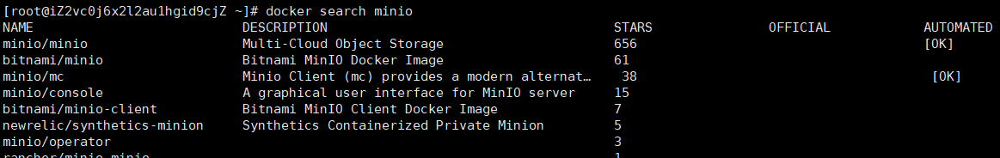
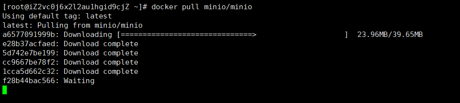
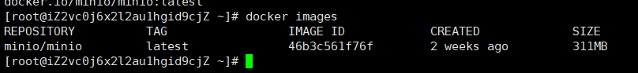
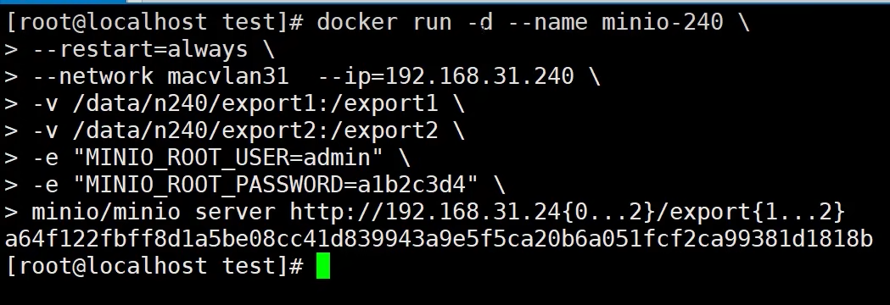

# MinIO 搭建部署

## 起步测试
我们首先部署一个单机节点的MinIO 进行试错，踩坑
```shell
#最近更新的命令
docker run -d \
  -p 9000:9000 \
  -p 9090:9090 \
  --name minio1 \
  --restart=always \
  -v /data/minio/node1/export1:/export1 \
  -v /data/minio/node1/export2:/export2 \
  -e "MINIO_ROOT_USER=admin" \
  -e "MINIO_ROOT_PASSWORD=minio@zy.com" \
  minio/minio server http://127.0.0.1/export{1...2} \
  --console-address ":9090"
```
成功后可以删除该容器.

## 系统基本环境配置
开启操纵系统的IPV4 转发，为后续使用Docker 的 macvlan 模式
```shell
cat >> /etc/sysctl.conf <<-'EOF'
net.ipv4.ip_forward=1
EOF
```
接下来重新加载 sysctl.conf 文件
```shell
sysctl -p
```

开启，配置 Docker macvlan 模式
> 阿里云服务器地址：47.108.146.141

```shell
docker network create -d macvlan \
--subnet=47.108.146.0/24 \
--ip-range=47.108.146.0/24 \
--gateway=47.108.146.1 \
-o parent=eth0 \
macvlan_minio
```

执行命令，结果如下：
```shell
[root@iZ2vc0j6x2l2au1hgid9cjZ ~]# clear
[root@iZ2vc0j6x2l2au1hgid9cjZ ~]# docker network create -d macvlan \
> --subnet=47.108.146.0/24 \
> --ip-range=47.108.146.0/24 \
> --gateway=47.108.146.1 \
> -o parent=eth0 \
> macvlan_minio
ba2a44593052b99e64e9a10563ce55a3e597032d328b4bd8b755803e8791ff07
[root@iZ2vc0j6x2l2au1hgid9cjZ ~]# 

```

## 镜像准备
1.Docker 搜索Minio镜像
```shell
docker search minio
```


2.Docker 拉取Minio镜像
```shell
docker pull minio/minio
```

镜像拉取成功后，使用`docker images` 可以查看本地安装的镜像


## 部署MinIO集群
### 启动MinIO镜像
这里指定该MinIO节点的ipd地址为`47.108.146.240`，指定了MinIO 集群节点的映射挂载存储文件为 `/data/minio/node250/export1`

这里我们设置MinIO的管理员账号密码为：`minio`,`minio@zy.com`
```shell
docker run -d --name minio-240 \
-p 9000:9000 \
-p 9001:9001 \
--restart=always \
--network macvlan_minio --ip=47.108.146.240 \
-v /data/minio/node240/export1:/export1 \
-v /data/minio/node240/export2:/export2 \
-e "MINIO_ROOT_USER=minio" \
-e "MINIO_ROOT_PASSWORD=minio@zy.com" \
minio/minio server http://47.108.146.24{0...2}/export{1...2} --console-address ":9001"
```


注意，如果此时启动错误，请使用 `docker logs 容器名` 命令查看具体的启动日志

如果出现错误，请停止，移除容器
```shell
docker stop 容器id #暂停容器
docker rm 容器id #删除停止的容器
```

### 集群启动
如果没有问题，我们接着启动第二台，第三台
```shell
docker run -d --name minio-241 \
-p 9000:9000 \
-p 9002:9002 \
--restart=always \
--network macvlan_minio --ip=47.108.146.241 \
-v /data/minio/node241/export1:/export1 \
-v /data/minio/node241/export2:/export2 \
-e "MINIO_ROOT_USER=minio" \
-e "MINIO_ROOT_PASSWORD=minio@zy.com" \
minio/minio server http://47.108.146.24{0...2}/export{1...2} --console-address ":9002"
```

第三个容器：
```shell
docker run -d --name minio-242 \
-p 9000:9000 \
-p 9003:9003 \
--restart=always \
--network macvlan_minio --ip=47.108.146.242 \
-v /data/minio/node242/export1:/export1 \
-v /data/minio/node242/export2:/export2 \
-e "MINIO_ROOT_USER=minio" \
-e "MINIO_ROOT_PASSWORD=minio@zy.com" \
minio/minio server http://47.108.146.24{0...2}/export{1...2} --console-address ":9003"
```

1.
```shell
docker  run -d --name minio-240 \
-p 9000:9000  \
-p 9001:9001  \
--restart=always \
-v /data/minio/config:/root/.minio \
-v /data/minio/n240/export1:/export1 \
-v /data/minio/n240/export2:/export2 \
-e "MINIO_ROOT_USER=minio" \
-e "MINIO_ROOT_PASSWORD=minio@zy.com" \
minio/minio server http://47.108.146.24{0...2}/export{1...2} \
--console-address ":9001"
```
2.
```shell
docker  run -d --name minio-241 \
-p 9000:9000  \
-p 9002:9002  \
--restart=always \
-v /data/minio/config:/root/.minio \
-v /data/minio/n241/export1:/export1 \
-v /data/minio/n241/export2:/export2 \
-e "MINIO_ROOT_USER=minio" \
-e "MINIO_ROOT_PASSWORD=minio@zy.com" \
minio/minio server http://47.108.146.24{0...2}/export{1...2} \
--console-address ":9002"
```
3.
```shell
docker  run -d --name minio-242 \
-p 9000:9000  \
-p 9003:9003  \
--restart=always \
-v /data/minio/config:/root/.minio \
-v /data/minio/n242/export1:/export1 \
-v /data/minio/n242/export2:/export2 \
-e "MINIO_ROOT_USER=minio" \
-e "MINIO_ROOT_PASSWORD=minio@zy.com" \
minio/minio server http://47.108.146.24{0...2}/export{1...2} \
--console-address ":9003"
```


## 参考文章
[基于Docker的Minio集群部署](https://blog.csdn.net/wu624218376/article/details/127522162)