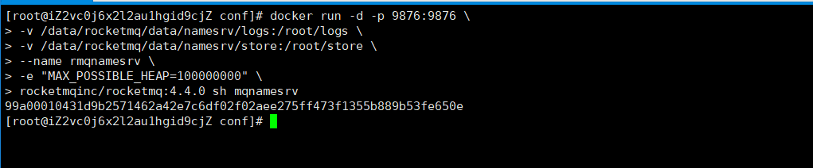
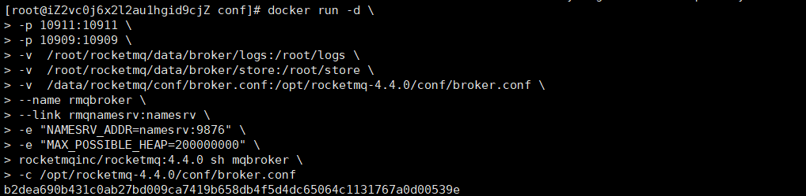
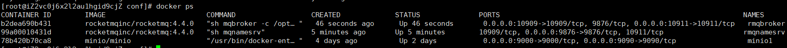
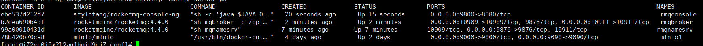

# RocketMQ安装部署,md

## 1.准备工作
防火墙开通端口 9876 10911 9800
```shell
firewall-cmd --zone=public --add-port=9876/tcp --permanent
firewall-cmd --zone=public --add-port=10911/tcp --permanent
firewall-cmd --zone=public --add-port=9800/tcp --permanent
firewall-cmd --reload
```

创建存储文件夹
```shell
mkdir -p /data/rocketmq/data/namesrv/logs
mkdir -p /data/rocketmq/data/namesrv/store
mkdir -p /data/rocketmq/conf
mkdir -p /data/rocketmq/data/broker/logs
mkdir -p /data/rocketmq/data/broker/store
```

进入到 /data/rocketmq/conf  文件夹下 创建文件 broker.conf
```shell
cd /data/rocketmq/conf
touch broker.conf
```

编辑 broker.conf 文件
````shell
vi broker.conf
````
加入以下配置 {}括号内需要换成自己服务器的外网IP
```shell
brokerClusterName = DefaultCluster
brokerName = broker-a
brokerId = 0
deleteWhen = 04
fileReservedTime = 48
brokerRole = ASYNC_MASTER
flushDiskType = ASYNC_FLUSH
brokerIP1 = {本地外网 IP}
```

拉取镜像
```shell
docker pull rocketmqinc/rocketmq:4.4.0
docker pull styletang/rocketmq-console-ng
```

## 2.创建 Namesrv 容器
运行创建容器命令
```shell
docker run -d -p 9876:9876 \
-v /data/rocketmq/data/namesrv/logs:/root/logs \
-v /data/rocketmq/data/namesrv/store:/root/store \
--name rmqnamesrv \
-e "MAX_POSSIBLE_HEAP=100000000" \
rocketmqinc/rocketmq:4.4.0 sh mqnamesrv

```


## 3.创建 broker 容器
运行创建容器命令
```shell
docker run -d \
-p 10911:10911 \
-p 10909:10909 \
-v  /root/rocketmq/data/broker/logs:/root/logs \
-v  /root/rocketmq/data/broker/store:/root/store \
-v  /data/rocketmq/conf/broker.conf:/opt/rocketmq-4.4.0/conf/broker.conf \
--name rmqbroker \
--link rmqnamesrv:namesrv \
-e "NAMESRV_ADDR=namesrv:9876" \
-e "MAX_POSSIBLE_HEAP=200000000" \
rocketmqinc/rocketmq:4.4.0 sh mqbroker \
-c /opt/rocketmq-4.4.0/conf/broker.conf
```



## 4.创建 console控制台 容器
运行创建容器命令
```shell
docker run -d \
--name rmqconsole \
-p 9800:8080 -\
-link rmqnamesrv:namesrv \
-e "JAVA_OPTS=-Drocketmq.namesrv.addr=namesrv:9876 -Dcom.rocketmq.sendMessageWithVIPChannel=false" \
-t styletang/rocketmq-console-ng
```


## 5.检验使用
访问控制台地址，查看监控信息
[console](http://47.108.146.141:9800/)

## 6.参考文章
[docker 安装 Rocketmq(namesrv broker 与可视化控制台 console)](https://blog.csdn.net/weixin_40461281/article/details/104115052)